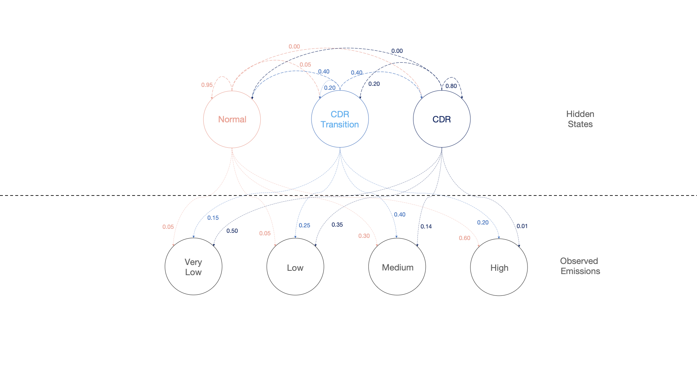
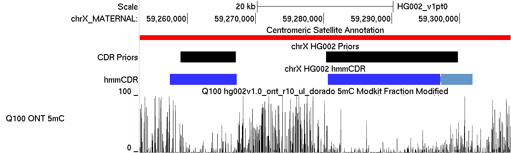

# `hmmCDR`

[](https://anaconda.org/jmmenend/hmmcdr)
[](https://hub.docker.com/r/jmmenend/hmmcdr)
[](https://pypi.org/project/hmmCDR/0.1.4/)

`hmmCDR` is a set of python scripts to predict CDR regions of active alpha satellite arrays. It takes a bedMethyl from `modkit` and a set CenSat Annotations in order to make predictions.

## Installation: 

`hmmCDR` can be installed through `conda`. With `bioconda` and `conda-forge` channels enabled.
```bash
conda install jmmenend::hmmcdr -c bioconda -c conda-forge
```

`hmmCDR` can be run with `docker`.
```bash
docker run -v .:/data jmmenend/hmmcdr:0.1.4 # YOUR FLAGS #
```

`hmmCDR` can be install through `pypi`. Although this requires a separate installation of `bedtools`.
```bash
pip install hmmCDR
```

NOTE: If you chose it install with only `pip` you need to install `bedtools` as well.

## Description:



This software is designed to find Centromere Dip Regions (CDRs), subCDRs, and their boundaries within the centromeric active alpha satellite (alpha-sat) array. CDRs are a uniquely hypo-methylated region within the typically hyper-methylated alpha-sat array. CDRs are tightly associated with the histone mark Centromere Protein A (CENP-A). This makes establishing accurate boundaries to CDRs and subCDRs essential to studying their relationship with CENPA. This method combines previous methods of identifying CDRs, through a sliding-window approach, with a Hidden Markov Model(HMM) that uses these sliding window estimates as a prior. The advantage to this two-fold approach is seen at the edges of the CDRs. A sliding window algorithm has a hard time drawing precise boundaries and identifying transitions in/out of the CDRs, whereas the HMM greatly improves identification of these regions. 




\* in this image the lighter blue represents a CDR transition. 

This python package takes in a bed file of 5mC methylation in aggregate, preferably from [modkit](https://github.com/nanoporetech/modkit), and an [Centromere-Satellite Annotation](https://github.com/kmiga/alphaAnnotation)(CenSat) file. The aggregate methylation file is used to determine where the 5mC depleted regions are, and the CenSat Annotation is used to subset the methylation files to only the alpha-sat array. This improves both the speed and accuracy of the CDR identification, as outside this region the trend of hypermethylation is not as strong. This package also processes each chromosome separately and in parallel to further improve speed.


## Inputs:
### 1. Modkit Pileup bedMethyl File:   

| column | name                  | description                                                                    | type  |
|--------|-----------------------|--------------------------------------------------------------------------------|-------|
| 1      | chrom                 | name of chromosome/contig                                                      | str   |
| 2      | start position        | 0-based start position                                                         | int   |
| 3      | end position          | 0-based exclusive end position                                                 | int   |
| 4      | modified base code    | single letter code for modified base                                           | str   |
| 5      | score                 | Equal to N<sub>valid_cov</sub>.                                                | int   |
| 6      | strand                | '+' for positive strand '-' for negative strand, '.' when strands are combined | str   |
| 7      | start position        | included for compatibility                                                     | int   |
| 8      | end position          | included for compatibility                                                     | int   |
| 9      | color                 | included for compatibility, always 255,0,0                                     | str   |
| 10     | N<sub>valid_cov</sub> | Refer to [modkit github](https://github.com/nanoporetech/modkit)               | int   |
| 11     | fraction modified     | N<sub>mod</sub> / N<sub>valid_cov</sub>                                        | float |
| 12     | N<sub>mod</sub>       | Refer to [modkit github](https://github.com/nanoporetech/modkit)               | int   |
| 13     | N<sub>canonical</sub> | Refer to [modkit github](https://github.com/nanoporetech/modkit)               | int   |
| 14     | N<sub>other_mod</sub> | Refer to [modkit github](https://github.com/nanoporetech/modkit)               | int   |
| 15     | N<sub>delete</sub>    | Refer to [modkit github](https://github.com/nanoporetech/modkit)               | int   |
| 16     | N<sub>fail</sub>      | Refer to [modkit github](https://github.com/nanoporetech/modkit)               | int   |
| 17     | N<sub>diff</sub>      | Refer to [modkit github](https://github.com/nanoporetech/modkit)               | int   |
| 18     | N<sub>nocall</sub>    | Refer to [modkit github](https://github.com/nanoporetech/modkit)               | int   |

### 2.  CenSat Annotation bed

| column | name                  | description                                                                    | type  |
|--------|-----------------------|--------------------------------------------------------------------------------|-------|
| 1      | chrom                 | name of chromosome/contig                                                      | str   |
| 2      | start position        | 0-based start position                                                         | int   |
| 3      | end position          | 0-based exclusive end position                                                 | int   |
| 4      | satellite type/name   | type of satellite and for some specific name in parentheses                    | str   |
| 5      | score                 | Not sure what if it is used for anytime.                                       | int   |
| 6      | strand                | '+' for positive strand '-' for negative strand, '.' if uncertain              | str   |
| 7      | start position        | included for compatibility                                                     | int   |
| 8      | end position          | included for compatibility                                                     | int   |
| 9      | color                 | color of the annotation in browser                                             | str   |


### Usage:
```
usage: hmmCDR [-h] [-m MOD_CODE] [-s SAT_TYPE] [--bedgraph] [--min_valid_cov MIN_VALID_COV] [--window_size WINDOW_SIZE] [--prior_percentile PRIOR_PERCENTILE]
              [--raw_thresholds] [--n_iter N_ITER] [--remove_transitions] [-w W] [-x X] [-y Y] [-z Z] [--merge_distance MERGE_DISTANCE] [--min_size MIN_SIZE]
              [--enrichment] [--main_color MAIN_COLOR] [--transition_color TRANSITION_COLOR] [--save_intermediates] [--output_label OUTPUT_LABEL]
              bedMethyl_path cenSat_path output_path

Process input files with optional parameters.

positional arguments:
  bedMethyl_path        Path to the bedMethyl file
  cenSat_path           Path to the CenSat BED file
  output_path           Output Path for the output files

options:
  -h, --help            show this help message and exit
  -m MOD_CODE, --mod_code MOD_CODE
                        Modification code to filter bedMethyl file (default: "m")
  -s SAT_TYPE, --sat_type SAT_TYPE
                        Comma-separated list of satellite types/names to filter CenSat bed file. (default: "H1L")
  --bedgraph            Flag indicating if the input is a bedgraph. (default: False)
  --min_valid_cov MIN_VALID_COV
                        Minimum Valid Coverage to consider a methylation site. (default: 10)
  --window_size WINDOW_SIZE
                        Window size to calculate prior regions. (default: 510)
  --prior_percentile PRIOR_PERCENTILE
                        Percentile for finding priorCDR regions. (default: 10)
  --raw_thresholds      Use values for flags w,x,y,z as raw threshold cutoffs for each emission category. (default: True)
  --n_iter N_ITER       Maximum number of iteration allowed for the HMM. (default: 1)
  --remove_transitions  Do not report transitions in final hmmCDR output file. (default: False)
  -w W                  Threshold of non-zero methylation percentile to be classified as very low (default: 0)
  -x X                  Threshold of non-zero methylation percentile to be classified as low (default: 25)
  -y Y                  Threshold of non-zero methylation percentile to be classified as medium (default: 50)
  -z Z                  Threshold of non-zero methylation percentile to be classified as high (default: 75)
  --merge_distance MERGE_DISTANCE
                        Distance to merge adjacently labelled regions. (default: 1021)
  --min_size MIN_SIZE   Minimum size for regions. (default: 3000)
  --enrichment          Enrichment flag. Pass in if you are looking for methylation enriched regions. (default: False)
  --main_color MAIN_COLOR
                        Color to dictate main regions. (default: 50,50,255)
  --transition_color TRANSITION_COLOR
                        Color to dictate transition regions. (default: 100,150,200)
  --save_intermediates  Set to true if you would like to save intermediates(filtered beds+window means). (default: False)
  --output_label OUTPUT_LABEL
                        Label to use for name column of hmmCDR BED file. Needs to match priorCDR label. (default: "CDR")
```

## License

This project is licensed under the MIT License.